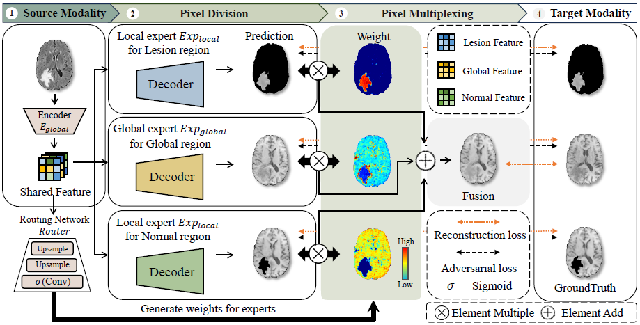
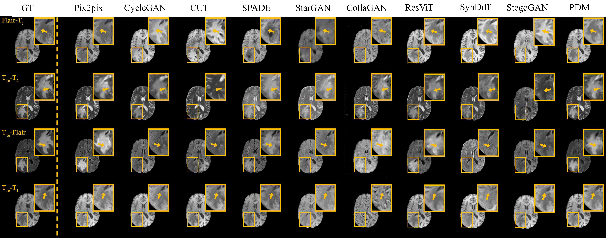
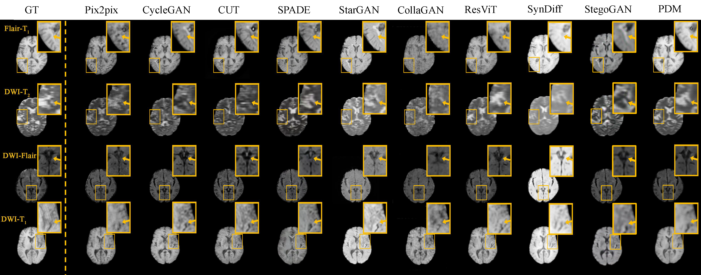

# Pixel-Division Multiplexing for MR Image Synthesis
The PyTorch implements of Pixel-Division Multiplexing for MR Image Synthesis

**The overview of our RTF framework.**


Our method can synthesis clear and nature MR images and outperforms other state-of-the-art methods.

Experiment results on **BraTS2020** dataset.


Experiment results on **ISLES2015** dataset.


## Environment
```
beautifulsoup4==4.11.1
dominate==2.6.0
imageio==2.19.1
matplotlib==3.5.2
numpy==1.19.5
opencv_contrib_python==4.7.0.72
opencv_python==4.5.5.64
opencv_python_headless==4.7.0.72
Pillow==9.0.1
Pillow==10.1.0
Requests==2.31.0
scikit_image==0.19.3
scipy==1.7.3
SimpleITK==2.3.1
torch==1.13.0
torchvision==0.14.0
visdom==0.1.8.9
wandb==0.16.1
loguru==0.7.2
tensorboard==2.9.1
```

# Datasets
Download the datasets from the official way and change the datapath in options. The official dataset structure is ok.

# Run
```
python train.py --dataroot /your/data/path --name exp_name --gpu_ids 0 --dataset_mode brats --direction flair_t1 
```
```
python test.py --test_dataroot /your/testdata/path --name exp_name --gpu_ids 0 --dataset_mode bratstest --direction flair_t1 
```